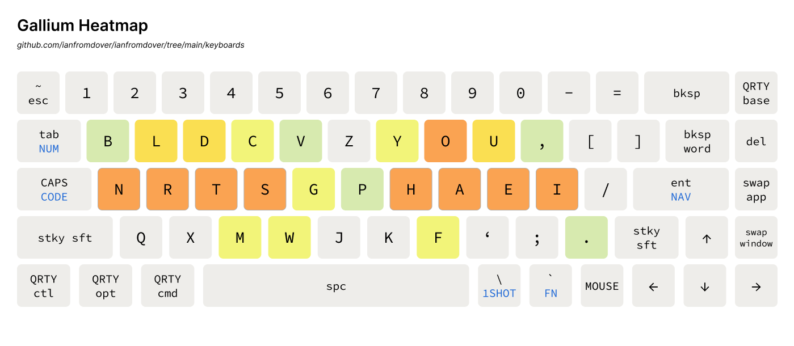
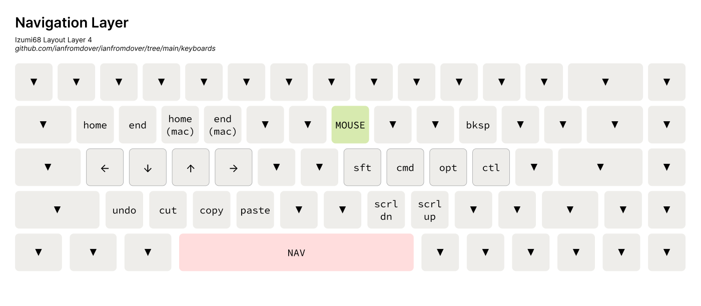
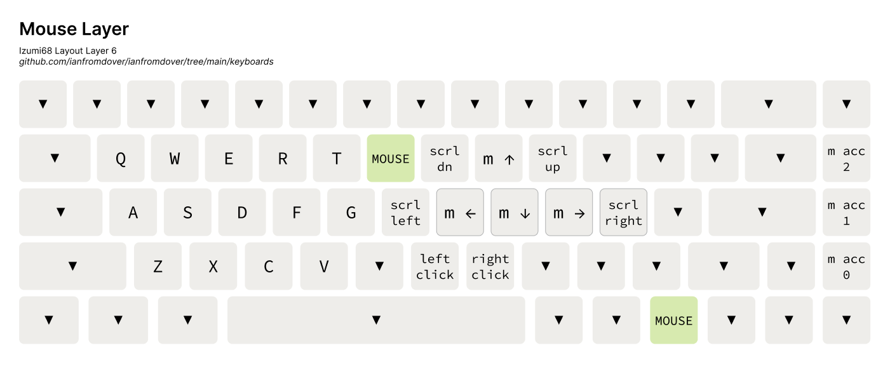
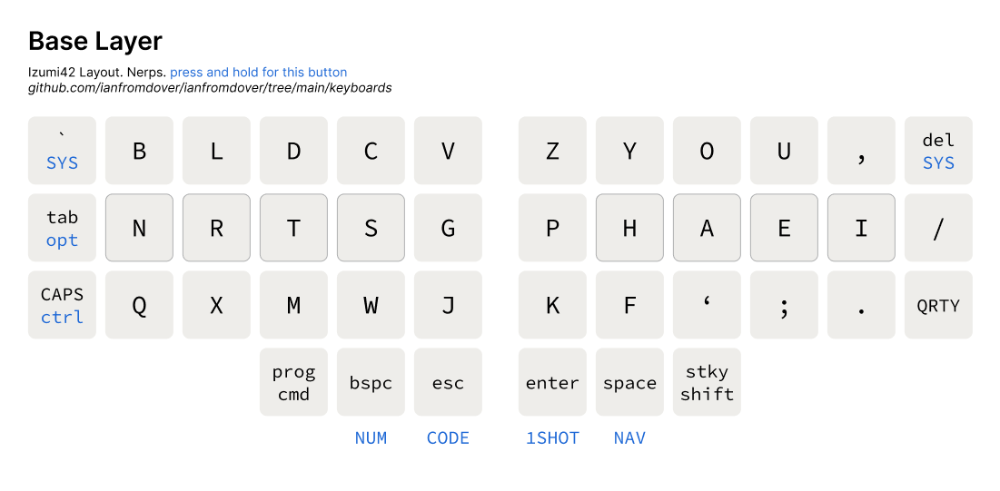
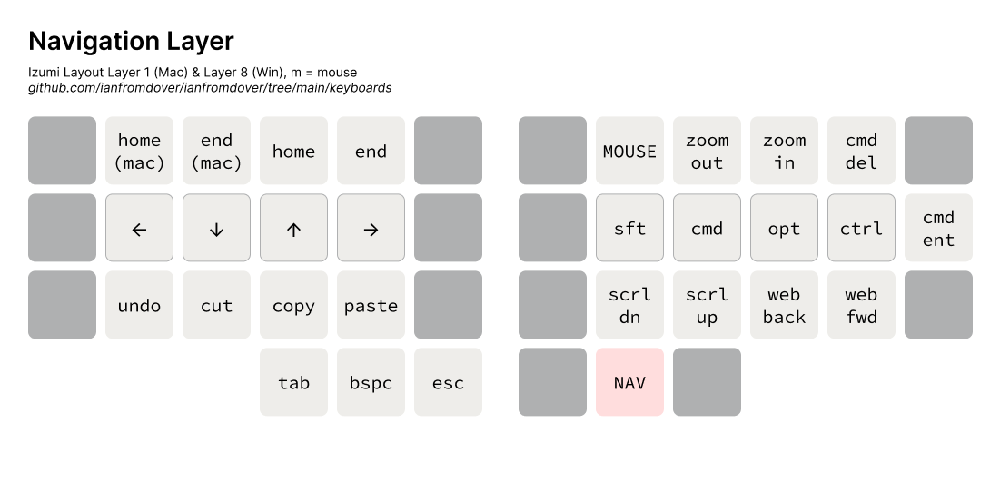
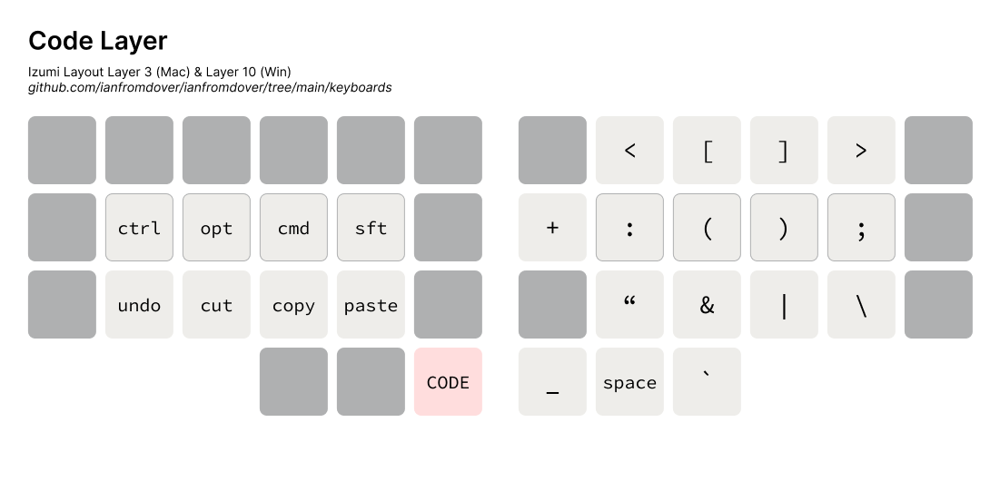
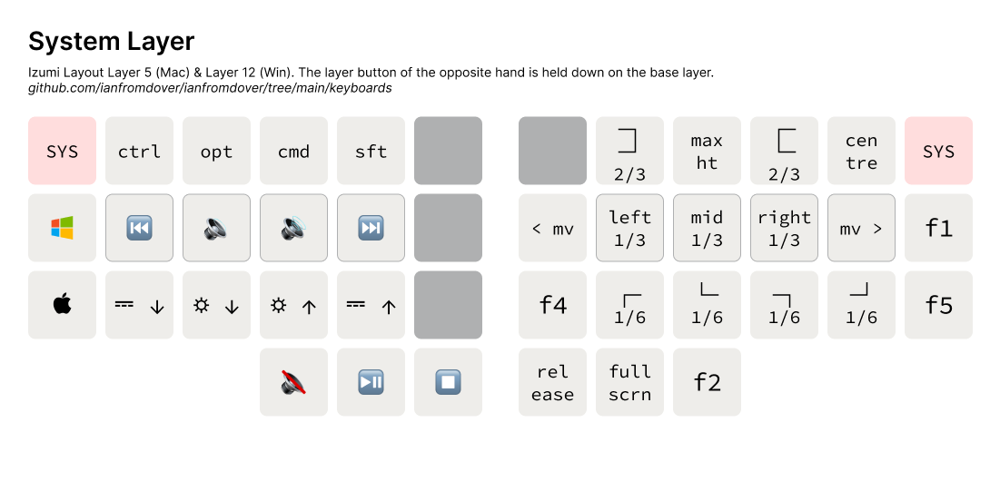
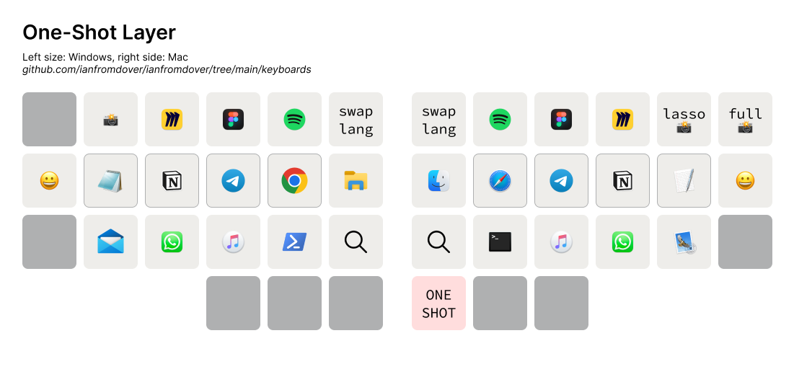
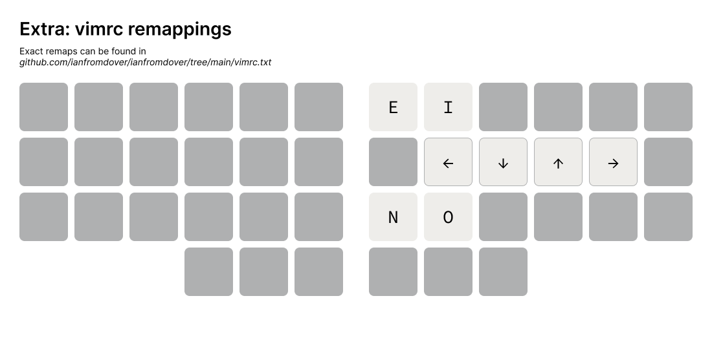

# The Izumi Layout

This layout first originated from `Miryoku` for a corne keyboard (with `Colemak-DH`),
incorporated ideas from `Callum`, and then it moved to a 68-key tofu65, with the alphas
slowly changing from `vanilla Canary` to my own concoction, borrowing inspiration from `Nerps`.

The latest iteration is Izumi68 v0.2

*Izumi68 is a 68-key layout.* The alphas are derived from Canary and Nerps. Here is the heatmap:



73.3% Similarity to Canary:


I didn't like where the position of `X`, `B`, and `W` were so I moved them around.
I also wanted the positions of `G` and `M` from Colemak-DH.

60% Similarity to Nerps:


I referred to Nerps to decide where to place the positions of the letters I didn't like in Canary, taking care to avoid SFBs.

Design considerations:

- use sticky keys instead of holding shift
- have macros for my most frequently used keys
- if a thumb key is held down, the corresponding hand's home row becomes modifiers that can be held down as well when appropriate
- qwerty layer for shortcuts(eg. cmd-Q), mouse control, gaming and Unity viewport control
- navigation layer includes arrow keys, `home`, `end`, that you can pair with shift and meta key, `copy`, `paste`, and window toggling
- favourite feature: control music volume and playback directly from the home row

## Izumi68 Layout

### Alphas - Izumi


### QWERTY


### Numbers


### Code


### Navigation



### Function Layer


### Mouse



Can also be used to play "FPS games" like Minecraft.

### One-Shot


## Izumi42

Section kept for legacy reasons.

*Izumi42 is a 42-key layout.* Design Principles:

- derived from the Miryoku and Callum layouts
  - includes all keys found on a TKL layout
  - use layers instead of reaching
  - use sticky keys instead of holding
  - use the home positions as much as possible
  - make use of the thumbs
- if a thumb key is held down, the corresponding hand's home row becomes modifiers that can be held down as well when appropriate
- qwerty layer for shortcuts(eg. cmd-Q), mouse control, gaming and Unity viewport control
- navigation layer includes arrow keys, `home`, `end`, that you can pair with shift and meta key, `copy`, `paste`, and window toggling
- favourite feature: control music volume and playback directly from the home row
- ergonomics determined by this chart from the colemak github:


### Base(Alphas) - Canary



### Navigation



### Numbers


### Code



### FPS

Also considered a 'mouse' layer, this layer is for playing Minecraft one-handed, or navigating in Unity using WASD.


### System



### One-Shot

Tapping any button in this layer brings you out of the layer. Meant for quick one-time-use functions. Launching the apps are achieved using macros.



### Note: Vim Remappings

(currently out of order)
Allows O(1) access to vim navigation. Sacrifices vim's J, L, K functionality



# Flashing the Izumi Layout to a Corne

Follow the instructions on the [official corne page](https://github.com/foostan/crkbd/blob/main/doc/firmware_en.md)
but use the .hex file in this repo to flash through QMK Toolbox instead.

# Running the Izumi Layout Using KMonad

Note: the latest layout version on KMonad is v4.6

## Windows
1. Simply navigate to this folder
2. use the `kmonad.exe` to run any .kbd file
3. for `win-izumi.kbd`, quit by selecting this terminal again, do NAV-q, and type Ctrl-c again to cancel the kmonad process

## MacOS
1. Follow the kmonad installation instructions below to install kmonad 
2. use the ./kmonad in the installation path to run the `mac-izumi.kbd` file
3. quit by selecting this terminal again and type `NAV-q` to cancel the kmonad process.  

4. (highly recommended) Create an alias `iz` to start this process easily from the terminal.

# Install KMonad on Mac
1. Follow the [guide on the KMonad](https://github.com/kmonad/kmonad/blob/master/doc/installation.md#installing-the-dext) repo to install kmonad on MacOS. I installed the `dext` because the kext had problems.
2. `brew install stack` 
3. `stack` might timeout when installing, just wait half an hour and try again.
4. The new kmonad executable is in `/Users/USERNAME/Documents/PATH-THAT-YOU-CLONED-KMONAD/kmonad/.stack-work/install/x86_64-osx/SOME-HASH/8.10.7/bin/kmonad`

# Izumi Canary

This is the (standard) row stagger keyboard layout for Izumi Canary, designed to be used with angle mod:

```
w l y p k z f o u ' [ ] \
 c r s t g m n e i a ;
  j v d b q x h , . /
```

I have modified it so that I can use the same layout on my ortho and row stagger keyboards. Here are some ways in which it is different from [vanilla Canary](https://github.com/Apsu/Canary):
- `'` and `;` are swapped
- `,`, `.` and `/` are in their QWERTY positions because my `Esc` is bound to `,.` in Vim
- `g` and `m` and `f` are moved to their positions in the ortho version of Canary, making words like `of`, `fountain` and `biology` easier to type
- `b` and `x` have been relegated to less convenient locations

Additionally, some people on the Canary discord have inspired me to make this a 'programmer' layout. Hence, when you hold down `⌘`, the keymap reverts to QWERTY so that you can use shortcuts normally.

## Running Izumi Canary Using Karabiner

To get Izumi Canary, first install [Homebrew](https://brew.sh) with

```bash
/bin/bash -c "$(curl -fsSL https://raw.githubusercontent.com/Homebrew/install/HEAD/install.sh)"
```

Afterwards, simply install [Karabiner](https://github.com/pqrs-org/Karabiner-Elements) with

```bash
brew install --cask karabiner-elements
```

Finally, place `karabiner.json` from this repo into `~/.config/karabiner`
